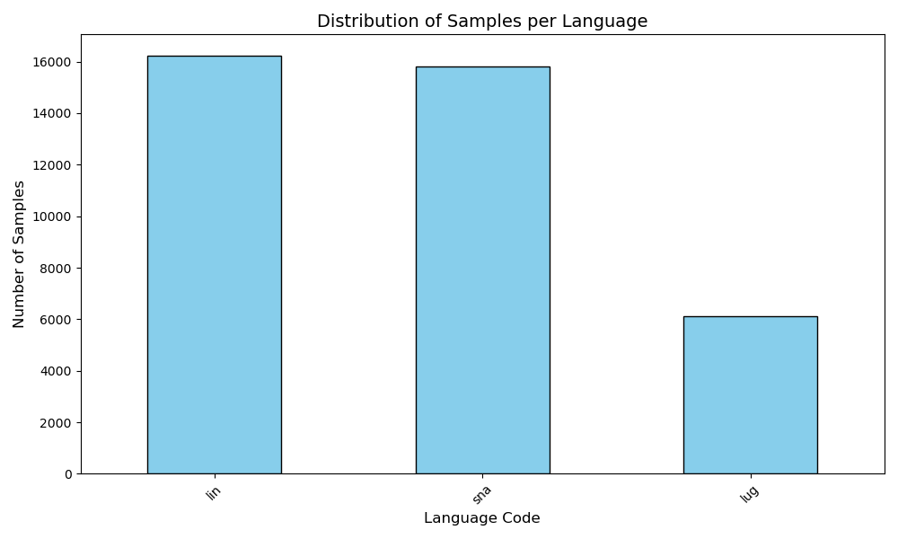
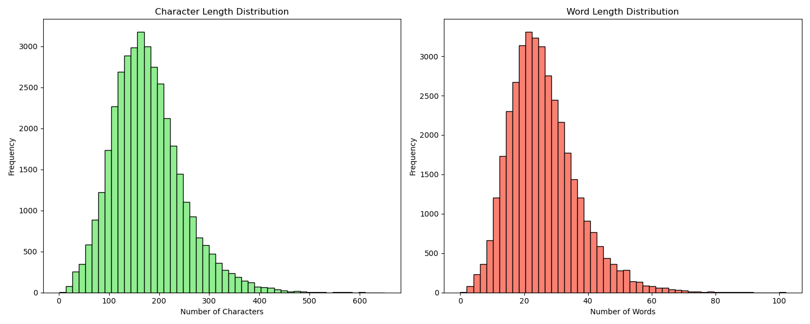

# Exploratory Data Analysis (EDA) Report
**Google WAXAL ASR Challenge**

## 1. Abstract
This document presents the Exploratory Data Analysis (EDA) performed on the metadata of the Google WAXAL ASR Challenge dataset. The goal of this analysis is to understand the data distribution, transcription characteristics, and vocabulary in order to inform the data preprocessing pipeline and the fine-tuning strategy for our state-of-the-art ASR model (Qwen3-ASR-1.7B).

## 2. Dataset Overview
The dataset consists of metadata mapping unique audio IDs to their corresponding text transcriptions and languages.
- **Total Training Samples:** 38,176
- **Total Test Samples:** 4,253

## 3. Language Distribution
The dataset focuses on three African languages. We observe an imbalance in the dataset, which is consistent across both the Training and Test sets.

**Training Set Distribution:**
- Lingala (`lin`): 16,240 samples (42.5%)
- Shona (`sna`): 15,817 samples (41.4%)
- Luganda (`lug`): 6,119 samples (16.0%)

**Test Set Distribution:**
- Lingala (`lin`): 1,866 samples
- Shona (`sna`): 1,749 samples
- Luganda (`lug`): 638 samples

*Observation:* Luganda is significantly underrepresented compared to Lingala and Shona. During training, we might consider applying class weights or oversampling Luganda to ensure the model does not become biased towards Lingala and Shona.

## 4. Transcription Length Analysis
Audio length and transcription length are highly correlated. Analyzing transcription length helps us set the `max_seq_length` for our model and catch potential outliers that could cause Out-Of-Memory (OOM) errors during training.

- **Mean Length:** 176 characters (~26 words)
- **Max Length:** 650 characters (~102 words)
- **Min Length:** 1 character (0 words - potential anomalies to investigate)

*Observation:* The transcriptions are generally short sentences. A `max_seq_length` of 256 or 512 tokens will be more than sufficient to cover 100% of the dataset without truncation. We should investigate and potentially filter out audio samples that have less than 5 characters, as they might be noise or bad data.

## 5. Vocabulary and Text Normalization Insights
A critical step in ASR is text normalization. We extracted the unique vocabulary from the entire training set to identify noise.

- **Total Unique Characters:** 91
- **Characters found:** ` !"&'(),-./0123456789:;<=>?\`abcdefghijklmnopqrstuvwxyz «»×àáâçèéêìíîïñòóôùúûüþāĝķĺŋœᵑ“”⭐️`

**Critical Findings:**
1. **Numbers are present (`0-9`):** ASR models generally transcribe speech into spelled-out words (e.g., "ten" instead of "10"). Having digits in the ground truth will severely penalize our Character Error Rate (CER). **Action:** We must implement a number-to-word conversion script (num2words) tailored for Lingala, Shona, and Luganda, or map them out.
2. **Punctuation and Special Symbols:** We found emojis (`⭐️`), various quote styles (`«»`, `“”`), and standard punctuation (`!`, `?`, `,`, `.`). **Action:** We must normalize the text by removing all non-alphanumeric characters and converting everything to lowercase. This standardizes the targets and vastly improves the CER.

## 6. Actionable Next Steps for the Data Pipeline
Based on this EDA, before feeding the data into Qwen3-ASR-1.7B, our `data_loader.py` must include a preprocessing function that:
1. Converts all text to lowercase.
2. Removes all punctuation and special symbols (including emojis).
3. Translates numeric digits into spoken words (or removes them if minimal).
4. Filters out extreme outliers (e.g., audio with transcriptions < 5 characters).
